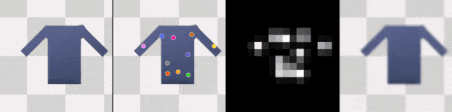
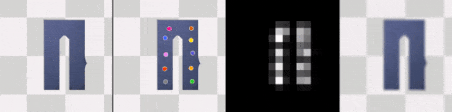
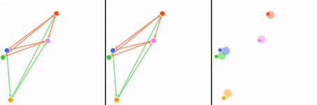
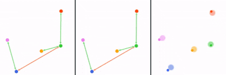
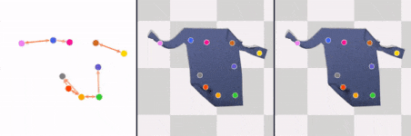
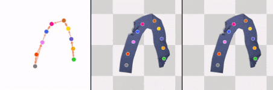

# Causal Discovery in Physical Systems from Videos
 
Yunzhu Li, Antonio Torralba, Animashree Anandkumar, Dieter Fox, and Animesh Garg

**NeurIPS 2020**
[[website]](https://yunzhuli.github.io/V-CDN/) [[arXiv]](https://arxiv.org/abs/2007.00631) [[video]](https://youtu.be/KnLyonKbymE)

Demo
-------------
#### Unsupervised Keypoint Detection
- From left to right:
- (1) Input image
- (2) Overlay of the detected keypoints and the input image
- (3) The corresponding heatmap of the keypoints
- (4) The reconstructed image

1. Multi-Body Interaction

<kbd></kbd>
<kbd></kbd>

2. Fabric Manipulation

<kbd></kbd>
<kbd></kbd>

#### Discover The Causal Summary Graph and Dynamics Prediction
1. Multi-Body Interaction
- From left to right:
- (1) Ground truth graph
- (2) Predicted Graph
- (3) Overlay of the predicted keypoint movements and the true future

<kbd></kbd>
<kbd></kbd>

2. Fabric Manipulation
- From left to right:
- (1) Predicted Graph
- (2) Overlay of the predicted keypoint movements and the true future
- (3) Ground truth keypoint movements

<kbd></kbd>
<kbd></kbd>

Installation
-------------
This codebase is tested with Ubuntu 18.04 LTS, Python 3.7.4, PyTorch 1.6.0, and CUDA 11.0.

Generate Demo Using Pre-trained Models
-------------
We provide pretrained models in the two environments to generate the demos. The checkpoints for unsupervised keypoint detection are stored in the `dump_{env}/train_{env}_kp_*/net_kp_epoch_*_iter_*.pth`, checkpoints for causal discovery and dynamics prediction are stored in `dump_{env}/train_{env}_dy_*/net_dy_epoch_*_iter_*.pth`.

We provide the following scripts to perform unsupervised keypoint detection with the pretrained model. The results will be stored in `dump_{env}/eval_{env}_kp_demo_*/`.

    bash scripts/demo_Ball_kp.sh
    bash scripts/demo_Cloth_kp.sh

The following scripts perform unsupervised keypoint detection, then discover the causal summary graph and predict the future. The results will be stored in `dump_{env}/eval_{env}_dy_demo_*/`.

    bash scripts/demo_Ball_dy.sh
    bash scripts/demo_Cloth_dy.sh

Evaluation Using Pre-trained Models
-------------
You will need to download the data from the followings links.
- Ball [[DropBox]](https://www.dropbox.com/s/flk4rzt5sa6tbu5/data_Ball.zip?dl=0) (3.53GB)
- Cloth [[DropBox]](https://www.dropbox.com/s/dd75rt9nhszgi97/data_Cloth.zip?dl=0) (15.06GB)

The organization of the codebase should follow the following structure, where `data_{enc}/` contains the raw images and metadata for each episode, `data_{env}_nKp_*/` contains pre-stored keypoints detected by the pretrained perception module.

    - v-cdn/
        - data/
            - data_Ball/
                - demo/
                - train/
                - valid/
                - stat.h5
            - data_Ball_nKp_5/
                - train/
                - valid/
            - data_Cloth/
            - data_Cloth_nKp_10/
        - dump_Ball/
        - dump_Cloth/
        - config.py
        - data.py
        ...

The following scripts generate and store the keypoints to `data/data_{env}_nKp_*/` using the pretrained unsupervised keypoint detection model. It will speed up the training process of the discovery and the dynamics modules. You can switch the option `--eval_set` from `valid` to `train`, and `--store_ed_idx` to an appropriate number to generate files for different data partitions.

    bash scripts/eval_Ball_kp.sh
    bash scripts/eval_Cloth_kp.sh

The following scripts evaluate the pretrained discovery and dynamics modules.

    bash scripts/eval_Ball_dy.sh
    bash scripts/eval_Cloth_dy.sh

Training the Perception, the Discovery, and the Dynamics Modules
-------------
You will have to first download and organize the data following the instructions in the previous section.

The following scripts train the perception module for unsupervised keypoint detection. In the Ball environment, you can switch the option `--gen_data` from `0` to `1` to generate new data.

    bash scripts/train_Ball_kp.sh
    bash scripts/train_Cloth_kp.sh

The following scripts train the discovery and the dynamics modules together. It will speed up the training process if you load from pre-stored keypoints. `data_{env}_nKp_*/` in the downloaded data contains pre-stored keypoints detected using our pretrained perception module. You can also regenerate the keypoints following the instructions in the previous section.

When training the discovery and the dynamics modules using the following scripts, set the option `--preload_kp` as `1` to allow the script to load the stored keypoints.

    bash scripts/train_Ball_dy.sh
    bash scripts/train_Cloth_dy.sh

Citing Our Paper
-----------------

If you find this codebase useful in your research, please consider citing:

    @article{li2020causal,
        title={Causal discovery in physical systems from videos},
        author={Li, Yunzhu and Torralba, Antonio and Anandkumar, Anima and Fox, Dieter and Garg, Animesh},
        journal={Advances in Neural Information Processing Systems},
        volume={33},
        year={2020}
    }

  For any questions, please contact Yunzhu Li (liyunzhu@mit.edu).

Related Work
---------------
[1] Unsupervised Learning of Object Keypoints for Perception and Control [[paper]](https://arxiv.org/abs/1906.11883)

[2] Neural Relational Inference for Interacting Systems [[paper]](https://arxiv.org/abs/1802.04687)
